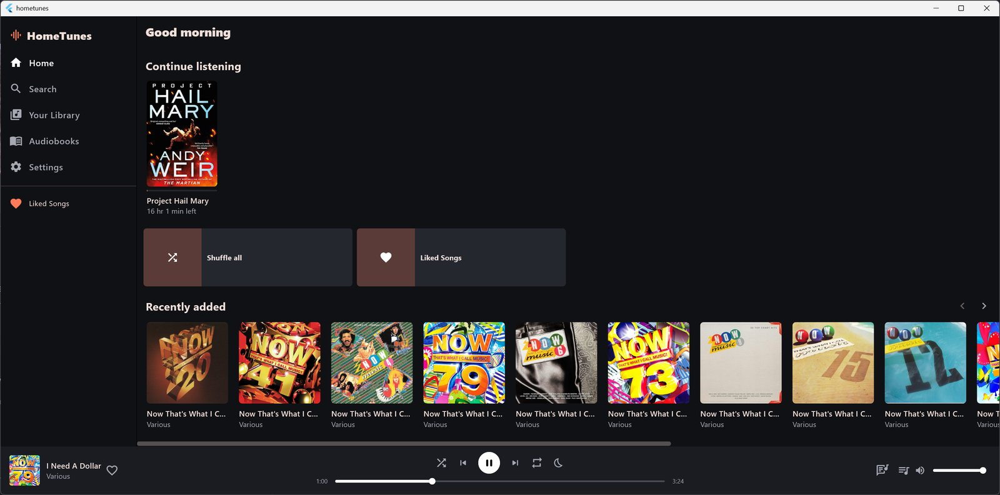
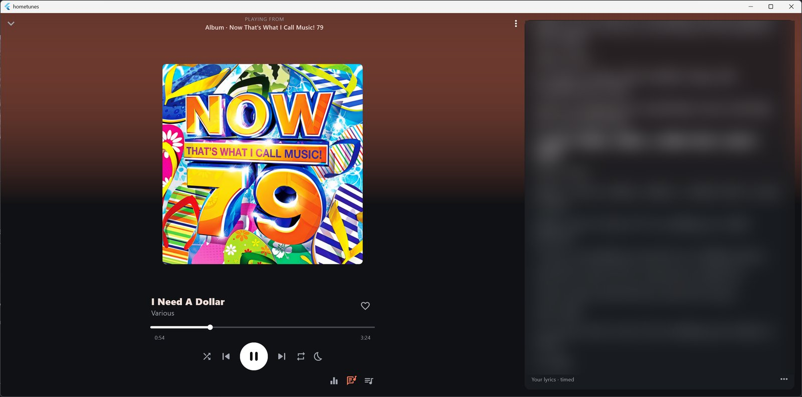

# HomeTunes: download and user guide

HomeTunes is a music and audiobook player for **your own files**, a bit like Spotify and Audible
but using music you already have. Point it at the folder where your music lives and it builds a
library of artists, albums, songs and audiobooks. You can also stream from your own music server
(Navidrome or another Subsonic server) if you have one.

It runs on **Android phones** and **Windows PCs**. There's no iPhone or Mac download.

---

## 1. Which file do I download?

Go to the [Releases page](https://github.com/Jamesking96/HomeTunes/releases). The newest version is
marked **Latest**. Under **Assets**, pick the file for your device:

| Your device | Download | What it is |
| --- | --- | --- |
| Android phone or tablet | `HomeTunes-<version>-android.apk` | The phone app |
| Windows PC (recommended) | `HomeTunes-Setup-<version>.exe` | Installer: adds HomeTunes to the Start menu |
| Windows PC (no install) | `HomeTunes-<version>-windows.zip` | A folder you can run from anywhere, even a USB stick |

Ignore the two "Source code" files. They're the code for developers, not the app.

**Checking a download (optional):** the release page ends with a **Checksums (SHA-256)** list, also
attached as `HomeTunes-<version>-SHA256SUMS.txt`. On Windows, open PowerShell in your Downloads
folder and run `Get-FileHash HomeTunes-Setup-<version>.exe` (use the name of the file you
downloaded). The long code it prints should match that file's line in the list. If it doesn't,
delete the file and download it again.

---

## 2. Installing on an Android phone

1. **On the phone**, open the Releases page in your browser and tap the `.apk` file to download it.
   (Or download it on a PC and copy it to the phone's Downloads folder.)
2. When it finishes, tap the download (in the browser's downloads or the **Files** app).
3. The first time, Android asks whether to allow installing apps from this source. Tap
   **Settings**, turn on **Allow from this source**, then go back.
4. Tap **Install**. If Google Play Protect says the app is from an unknown developer, tap
   **More details › Install anyway**. HomeTunes isn't on the Play Store, so this is expected.
5. Open HomeTunes. When it asks to access **music and audio**, tap **Allow**. Without this it
   can't see your music.

**Updating:** download the newer `.apk` and install it the same way, over the top. Don't uninstall
first: your library, playlists, places in books and settings are all kept.

**Coming from 0.1.20 or earlier:** version 0.1.21 is signed with HomeTunes' own key instead of a
temporary one, so Android won't install it over an older version (it says the app conflicts
with an existing one). This happens only once:
1. In the old version, go to **Settings › Backup & restore › Export** and save the file in
   **Downloads**.
2. Uninstall HomeTunes, then install the new `.apk`.
3. Open it, go to **Settings › Backup & restore › Restore**, pick the file and choose **Replace**.
4. If you use a music server, type its password again in **Settings › Servers**.

After that, every update installs over the top as normal.

**Updating:** go to **Settings › About › Check for updates** (from version 0.1.23). If there's a
newer version, **Open download page** takes you to it in your browser: download the `.apk` and
open it to install over the top.

---

## 3. Installing on a Windows PC

### With the installer (recommended)
1. Download `HomeTunes-Setup-<version>.exe` and open it.
2. If Windows shows **"Windows protected your PC"**, click **More info › Run anyway**. The app
   isn't signed with a paid certificate, so Windows doesn't recognise it yet.
3. Follow the steps. No administrator password is needed; it installs just for you unless you
   choose otherwise.
4. Start HomeTunes from the Start menu.

**Updating:** from version 0.1.23, go to **Settings › About › Check for updates**. If there's a
newer version, say **Update**: HomeTunes downloads it, checks the file, closes, updates itself
and opens again. (Or run the newer installer yourself.) Your library and settings are kept.
**Uninstalling:** Windows Settings › Apps › HomeTunes › Uninstall.

### Without installing (zip)
1. Download `HomeTunes-<version>-windows.zip`.
2. Right-click it › **Extract All…**, and choose where to put the folder.
3. Open the folder and double-click `hometunes.exe`. Keep all the files together; the app needs
   them.

A copy run from the zip can tell you when there's a new version, but can't update itself: it
opens the download page instead.

---

## 4. First steps

### Add your music
1. The Home screen says **No music yet**. Tap **Add music**
   (or go to **Settings › Library › Music folders › Add folder**).
2. Choose the folder where your music is kept. HomeTunes reads the details (artist, album, cover
   art…) from your files. The progress shows at the bottom of the screen.
3. Add more folders the same way. After adding new music to a folder, press **Rescan**.

HomeTunes plays MP3, FLAC, M4A/AAC, OGG, Opus, WAV and M4B files. It never changes, moves or
deletes your music files.

### Audiobooks
Audiobooks appear in the **Books** tab (called **Audiobooks** on a PC). HomeTunes spots them by their genre (such as
"Audiobook"), `.m4b` files, or a folder called something like "Audiobooks". To make a whole folder
count as books, go to **Settings › Audiobooks** and use **Add audiobook folder**. Books remember where
you got to, and **Continue listening** on the Home screen picks up where you left off.

### Music from your own server (optional)
If you run a music server such as Navidrome, go to **Settings › Servers › Music server**, enter its
address (for example `http://192.168.1.20:4533`), your username and password, then **Connect**.
Server songs show a small cloud icon and mix in with your own files.

If you type an address without `http://` or `https://`, HomeTunes tries a secure (https)
connection first. If the server is on the internet and only answers over plain http, HomeTunes
asks before using it, because your sign-in could then be read on the way. Addresses on your home
network (and Tailscale addresses) connect without asking.

---

## 5. Everyday use

The main sections are **Home**, **Search**, **Library**, **Books** and **Settings**. On a phone
they're tabs along the bottom. On a PC they're down the left-hand side, where Library is called
**Your Library** and Books is called **Audiobooks**, with **Liked Songs** underneath.

- **Play something:** tap a song, album, playlist or book. The player bar at the bottom shows
  what's playing; tap it for the full **Now Playing** screen.

  

  Under the controls are buttons for the **equaliser**, **lyrics** and the **queue** (what's
  playing next, which you can reorder).
- **Lyrics:** HomeTunes shows a song's lyrics when it can find them (in the file, a `.lrc` file
  next to it, your music server, or online). Timed lyrics scroll along with the song.
- **On a phone:** swipe the player left or right to skip. The music keeps playing with the screen
  locked, and you can control it from the lock screen, the notification or headphone buttons.
- **On a PC:** your keyboard's media keys work.
- **Search:** finds songs, artists, albums, books and chapters. Every word you type must match.
- **Playlists and favourites:** make playlists in **Library**, like songs with the heart, and
  heart whole albums or books. Library tabs have filters and sorting, including **Favourites**.
- **Menus:** right-click (PC) or press and hold (phone) on an album, book or song for quick
  actions: edit details, choose a cover, favourite, and **Details…** (where it came from).
- **Fix wrong details:** use **Edit details**. Select several albums or books to edit them together.
  Your changes are kept by HomeTunes and don't touch the files, unless you choose to save
  them into the files in **Settings › Your edits**.
- **Equaliser:** in **Settings › Playback** or the button on Now Playing. Pick a preset or make
  your own. Audiobooks can use their own preset automatically.
- **Sleep timer:** the moon button next to the play controls stops playback after a set time or at the end of the chapter or song.
  Options are in **Settings › Sleep timer**.
- **Volume:** the slider in the player bar on a PC, under the play controls on Now Playing (with the
  cover or the lyrics showing), and the speaker button in the phone's mini player, which opens a
  small slider.
- **Updates:** HomeTunes looks for a new version once a day and shows a notice with an **Update…**
  button if there is one. Check any time in **Settings › About › Check for updates**, where
  there's also a switch to turn the daily check off.
- **Colours:** **Settings › Appearance** has three ready-made themes (Default, Midnight and Forest)
  and **Your own**, where you pick a highlight colour and a background colour. Tap a theme and
  the whole app changes straight away. Your choice is included in backups.
- **Settings search:** type in the box at the top of Settings to find any option.

---

## 6. Moving to a new device, and backups

**Settings › Backup & restore** saves everything HomeTunes keeps (folders, playlists, likes,
favourites, your edits, places in books, bookmarks, equaliser and settings) into one `.htbackup`
file. Restore it on another phone or PC to carry it all across, then point HomeTunes at the music
folders on that device.

Your music server password is **never** put in the backup file, so it can't be read by anyone who
gets hold of the file. After restoring on a new device, type it in once under **Settings ›
Servers**. (Restoring on the same device keeps it.)

On Android, HomeTunes doesn't use Google's automatic app backup. When you move to a new phone,
use a HomeTunes backup file as described above.

---

## 7. If something goes wrong

- **No music shows up on the phone:** check HomeTunes may access music. Android Settings ›
  Apps › HomeTunes › Permissions › **Music and audio** › Allow. Then **Rescan**.
- **Some songs are missing:** make sure their folder is listed in **Settings › Library**, then
  press **Rescan**.
- **Playback stops or behaves oddly:** open **Settings › About › Playback log**, tap **Copy**, and
  send it along with a description of what happened.
- **Windows won't start the app:** if you used the zip, make sure you extracted it first (don't run
  it from inside the zip).

The version you're running is shown in **Settings › About**.
